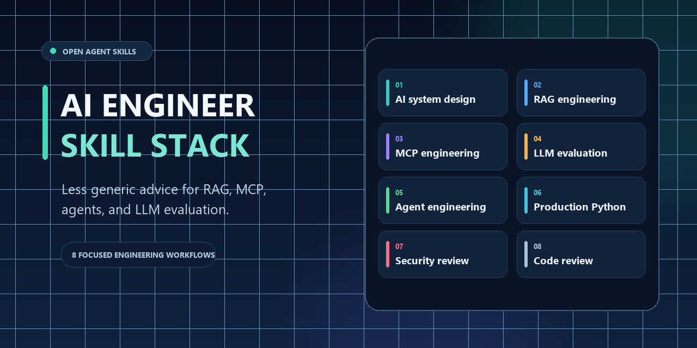

# AI Engineer Skill Stack



[](https://github.com/mehulpratapsing/ai-engineer-skill-stack/actions/workflows/monitor-primary-sources.yml)
[](https://github.com/mehulpratapsing/ai-engineer-skill-stack/actions/workflows/monitor-primary-sources.yml)

**Production-minded AI engineering, not demo-day advice.** Start with `break-my-agent`: use `/break-my-agent` in Claude Code, `$break-my-agent` in Codex, or select the skill by name in OpenCode. It interviews one question at a time, then gives you a risk list, an evaluation plan, and a handoff to the specialist skills.

Coding agents can give generic or stale advice on RAG, MCP, agents, and evaluation. This package pairs a front-door interview skill with eight focused workflows for system design, implementation, evaluation, and security review. The skills direct agents to inspect the project, check pinned versions, and report evidence, assumptions, and concrete risks.

## Enterprise adoption boundary

This is a reusable engineering baseline, not an organization policy, security approval, legal opinion, or compliance certification. Organization-specific rules were not supplied, so the skills do not invent approved model/provider lists, data classifications, retention periods, residency rules, spend thresholds, evaluation cutoffs, or release authorities. Before use in a governed environment, connect the stack to applicable internal policies and approved environments. Put project-specific requirements in the repository's governed instruction and policy files and resolve conflicts with the responsible owner.

A skill does not grant permission to access data, call external systems, conduct intrusive security testing, or make production changes. Follow the user's authorization, repository policy, and target environment's controls.

## Install with the Skills CLI

Run one command from the target project root. These project-scope commands install all skills for the named agent:

```sh
# OpenCode
npx skills add mehulpratapsing/ai-engineer-skill-stack --agent opencode --skill '*' --copy --yes

# Codex
npx skills add mehulpratapsing/ai-engineer-skill-stack --agent codex --skill '*' --copy --yes

# Claude Code
npx skills add mehulpratapsing/ai-engineer-skill-stack --agent claude-code --skill '*' --copy --yes
```

Add `--global` to install into the current user's agent profile. The repository layout was tested with the Skills CLI: it discovers valid `SKILL.md` files under `.agents/skills` and installs them into the selected agent's documented project path. This checks package discovery and file placement; it does not prove that every agent version will invoke a skill in every configuration. Verify discovery in the installed agent before relying on a workflow. The CLI may send anonymous installation telemetry unless `DISABLE_TELEMETRY=1` is set; see the [Skills CLI documentation](https://skills.sh/docs/cli).

## What is included

| Skill | Use it for |
|---|---|
| `break-my-agent` | One-question-at-a-time discovery that ends with risks, an evaluation plan, and a specialist handoff |
| `ai-system-design` | Requirements-to-architecture decisions, trust boundaries, operations, and rollout |
| `rag-engineering` | Authorized ingestion, retrieval, grounding, citations, quality, latency, and cost |
| `mcp-engineering` | MCP clients/servers, tools, resources, authorization, security, and deployment |
| `llm-evaluation` | Golden datasets, judge calibration, metrics, regression tests, and release gates |
| `python-production` | Typed, secure, observable Python services and APIs |
| `agent-engineering` | Bounded agent loops, tool use, state, orchestration, interruption, and recovery |
| `security-review` | Evidence-based security review of AI systems and connected applications |
| `code-review` | Focused review for concrete correctness, security, compatibility, and maintainability defects |

See [STACK_GUIDE.md](STACK_GUIDE.md) for combinations and handoffs.

The skill ID is `break-my-agent`. Claude Code exposes user-invocable skills as slash commands; Codex uses `$skill-name` mentions, while OpenCode discovers skills through its native skill tool. Use the agent's documented syntax for other products.

## See the difference

The [RAG review example](examples/rag-review/README.md) uses the same small pipeline and the same prompt, `review this RAG pipeline`, to show a generic review beside a skill-guided review. The second example ties findings to code, conditions severity on actual data boundaries, and proposes checks for authorization, injection, logging, citations, and abstention.

The outputs are hand-written illustrations of the stack's intended review shape, not recorded model runs or a benchmark. We do not have a recorded real-agent failure story or paired benchmark yet. Model behavior depends on the model, version, surrounding instructions, tools, and task. For a measured comparison, run both conditions with the same model and configuration on a representative blinded set and score against a pre-agreed rubric.

The [`benchmarks/`](benchmarks/README.md) directory contains ten synthetic, preregistered prompts and a published scoring rubric. It records no results until real paired runs are completed.

## Install

For agent-targeted installation, use the [Skills CLI commands above](#install-with-the-skills-cli). To install this package's canonical `.agents/skills` directories directly, the shell and PowerShell installers below copy missing skill directories and skip existing IDs so local skill edits are not overwritten.

One-line global install from macOS/Linux (replace the final `codex` target with `opencode` or `claude` if needed):

```sh
git clone --depth 1 https://github.com/mehulpratapsing/ai-engineer-skill-stack.git ai-engineer-skill-stack && ./ai-engineer-skill-stack/scripts/install.sh codex --global
```

On Windows, use PowerShell:

```powershell
git clone --depth 1 https://github.com/mehulpratapsing/ai-engineer-skill-stack.git ai-engineer-skill-stack; if ($LASTEXITCODE -eq 0) { powershell.exe -NoProfile -ExecutionPolicy Bypass -File .\ai-engineer-skill-stack\scripts\install.ps1 -Target codex -Scope global }
```

### OpenCode

Project install (run from the target repository root):

```sh
/path/to/ai-engineer-skill-stack/scripts/install.sh opencode --project
```

Global install:

```sh
/path/to/ai-engineer-skill-stack/scripts/install.sh opencode --global
```

OpenCode uses `.agents/skills` for project skills and supports `~/.agents/skills` globally.

### Codex

Project install uses `.agents/skills`:

```sh
/path/to/ai-engineer-skill-stack/scripts/install.sh codex --project
```

Global install uses `$CODEX_HOME/skills`, or `~/.codex/skills` when `CODEX_HOME` is unset:

```sh
/path/to/ai-engineer-skill-stack/scripts/install.sh codex --global
```

### Claude Code

The skill content follows the open Agent Skills format. Other compatible agents may load it from their documented skill directories; installation guidance here covers OpenCode, Codex, and Claude Code.

Claude Code supports the Agent Skills format. Project skills live in `.claude/skills`; personal skills live in `~/.claude/skills`.

```sh
/path/to/ai-engineer-skill-stack/scripts/install.sh claude --project
/path/to/ai-engineer-skill-stack/scripts/install.sh claude --global
```

On Windows, use PowerShell:

```powershell
powershell.exe -NoProfile -ExecutionPolicy Bypass -File C:\path\to\ai-engineer-skill-stack\scripts\install.ps1 -Target claude -Scope global
```

Replace `claude` with `opencode` or `codex` as needed. Use `-Scope Project` for a project install. For a project install, run the command with the target repository as the current directory. The package keeps its portable source under `.agents/skills`; the installer maps it to each tool's documented discovery path. Codex-only `agents/openai.yaml` files supply UI metadata and are ignored by other tools.

To install without a script, copy the skill folders from `.agents/skills/` into the destination above. Review skill files before installing them. If a target already has a skill with the same ID, the installer skips it and reports the destination; compare or merge changes deliberately.

### Verify an installation

Restart or refresh the agent session, ask it to list available skills, and invoke one relevant skill explicitly. Tool configuration, the active working directory, or managed policy may affect discovery; consult the agent's docs if a skill is missing.

## Optional tool integrations

- **Context7:** When its MCP server is configured, use it for focused, version-specific library documentation in architecture and implementation work. Match the library and version to the repository's dependency files, verify important details against official documentation, and keep secrets, private source code, and restricted data out of queries. Context7 is optional; use official sources when it is unavailable. See [Context7 documentation](https://context7.com/docs/overview).
- **Strix:** The `security-review` skill may use Strix for dynamic testing only when the user explicitly authorizes a defined scope. Confirm target ownership, allowed actions, environment, data handling, and resource limits first; prefer staging or a disposable checkout. Strix can send exploit payloads and change target data. Review the [official Strix testing workflow](https://github.com/usestrix/strix/blob/main/skills/application-security-testing/SKILL.md) before use. Strix is optional and does not make a skill invocation permission to scan.

## Contributing

See [CONTRIBUTING.md](CONTRIBUTING.md) for scope, source, review, and validation expectations. Good first issues are labeled in the [issue tracker](https://github.com/mehulpratapsing/ai-engineer-skill-stack/issues?q=is%3Aissue+is%3Aopen+label%3A%22good+first+issue%22).

## References and maintenance

Standards, protocol revisions, SDK APIs, model capabilities, and security taxonomies change. Verify the target repository's pinned versions and primary documentation before implementation. The focused references in the RAG and MCP skills are orientation, not substitutes for those checks.

The dated badge above records the date a maintainer reviewed the tracked sources and refreshed their content hashes. A [weekly GitHub Action](.github/workflows/monitor-primary-sources.yml) checks the Model Context Protocol specification, NIST's GenAI profile, OWASP's 2026 LLM Top 10, and OpenTelemetry's GenAI semantic conventions. On detected content changes it opens one review issue; it does not update skill guidance or the baseline automatically. Network failures fail the check without implying that a source changed. See [`references/monitored-sources.json`](references/monitored-sources.json) and [`references/monitored-sources.lock.json`](references/monitored-sources.lock.json).

Sources for skill and installation format checked on 2026-10-02:

- [Agent Skills open specification](https://agentskills.io/specification)
- [Claude Code skills](https://code.claude.com/docs/en/skills)
- [OpenCode Agent Skills](https://opencode.ai/docs/skills)
- [Codex skills documentation](https://developers.openai.com/plugins/concepts/skills)
- [Codex skill invocation and evaluation guidance](https://developers.openai.com/blog/eval-skills)
- [Context7 documentation](https://context7.com/docs/overview)
- [Strix application security testing workflow](https://github.com/usestrix/strix/blob/main/skills/application-security-testing/SKILL.md)

The tracked technical sources and installation references were reviewed on 2026-10-02. The baseline monitors changes; it does not validate policy fit or replace a fresh review for a consequential design or release.

## License

This project is licensed under the Apache License, Version 2.0. See [LICENSE](LICENSE).
